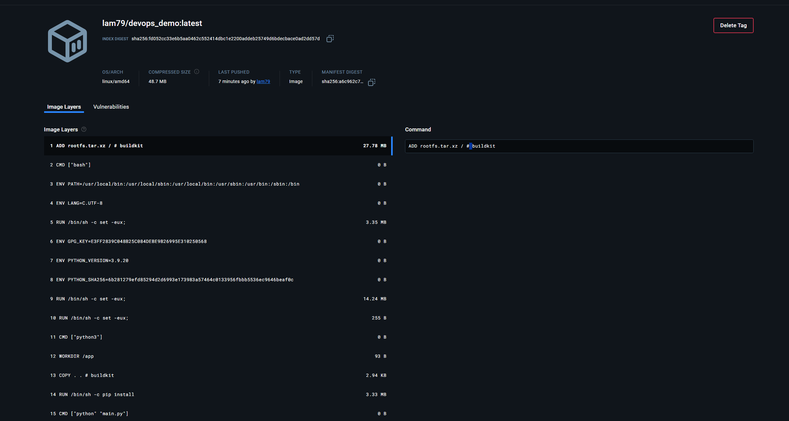

# DevOps Demo Repository

This repository demonstrates a CI/CD pipeline with GitHub Actions to automatically test, build, and push a Docker image to Docker Hub.

## Docker Image Screenshot



## Project Structure
- **app/**: Application code
- **tests/**: Test scripts
- **Dockerfile**: Docker configuration
- **.github/workflows/**: CI/CD workflow

## CI/CD Workflow
- **Tests**: Runs pytest for unit testing.
- **Build and Push**: Builds the Docker image and pushes it to Docker Hub.

## How to Use
1. Pull the Docker image:
   ```bash
   docker pull lam79/devops_demo:latest
